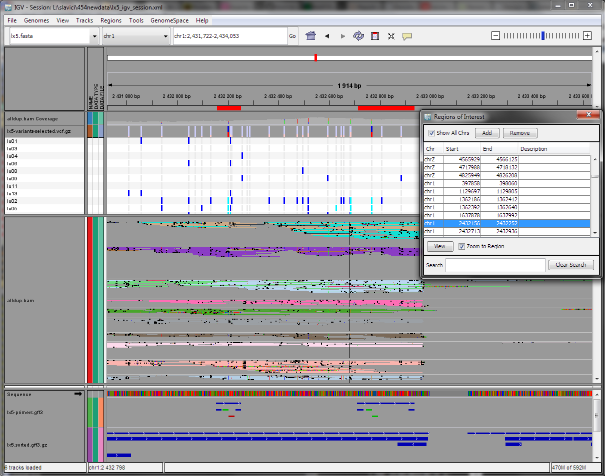

IGV with all data produced by Scrimer
=====================================

Tracks, from top to bottom:

- genome navigator, 'genome' produced in :doc:`3-map-contigs`
- ``alldup.bam coverage`` - total coverage for the region, produced in :doc:`4-map-reads`
- ``lx5-variants-selected.vcf.gz`` - summary of the variants, filtered variants 
  are shown in lighter color,
  produced in :doc:`5-choose-variants`
- sample list - provides detailed information on variants in each sample
- ``alldup.bam`` - details on coverage and SNP (colored) / INDEL (black), in the context menu
  choose ``Group alignments by > sample`` and ``Color alignments by > read group``,
  produced in :doc:`4-map-reads`
- sequence
- ``lx5-primers.gff3`` - resulting primers, hover with mouse for details on calculated properties,
  produced in :doc:`6-design-primers`
- ``lx5.sorted.gff3.gz`` - annotations for the scaffold - predicted and transferred exons,
  produced in :doc:`3-map-contigs`
- floating window with a list of designed primers, produced in :doc:`6-design-primers`

How to get to this view
-----------------------

- run IGV (version 2.2 is used here)
- ``Genomes > Load genome from file``, choose your scaffold
- load all the tracks by ``File > Load from File``
- rearrange tracks according to your preference by dragging the label with the mouse
- choose ``Regions > Import Regions``, pick the ``.bed`` file created in :doc:`6-design-primers`,
  choose ``Regions > Region Navigator``
