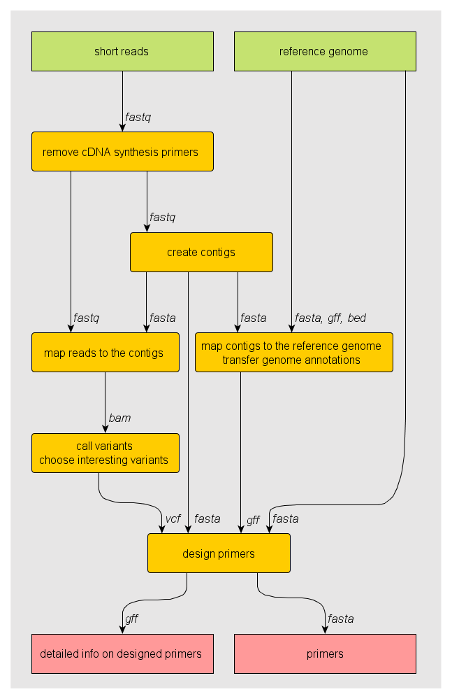

Scrimer
=======

Scrimer is a Linux pipeline for designing PCR and genotyping primers from 454 transcriptomic data. 

Pipeline workflow
-----------------

.. toctree::
   :maxdepth: 1
   
   prepare-reference
   remove-adaptors
   reference-assembly
   map-contigs
   map-reads
   choose-variants
   design-primers

Component documentation
-----------------------

.. toctree::
   :maxdepth: 3

   components

Dataflow
--------

Dataflow diagram of the pipeline. Inputs are in green, processing steps in yellow and results in red.

License
-------
Scrimer is licensed under `GNU Affero General Public License <http://www.gnu.org/licenses/agpl.html>`_. 
Contact the author if you're interested in other licensing terms.

Author
------
| Libor Morkovsky
| Department of Zoology
| Charles University in Prague
| Czech Republic
| morkovsk[at]natur.cuni.cz

Software used
-------------

.. store all software references here, and cite them throughout the documents

.. [BioPython] http://biopython.org/
.. [lastz] http://www.bx.psu.edu/~rsharris/lastz/
.. [bedtools] http://code.google.com/p/bedtools/
.. [tabix] http://samtools.sourceforge.net/tabix.shtml
.. [sort-alt] https://github.com/lh3/foreign/tree/master/sort
.. [gmap] http://research-pub.gene.com/gmap/
.. [samtools] http://samtools.sourceforge.net/
.. [smalt] http://www.sanger.ac.uk/resources/software/smalt/
.. [fastqc] http://www.bioinformatics.babraham.ac.uk/projects/fastqc/

