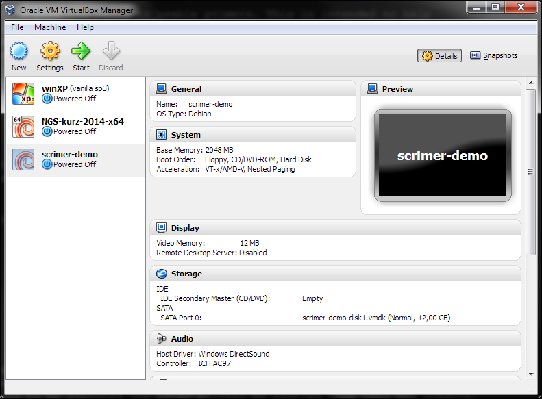
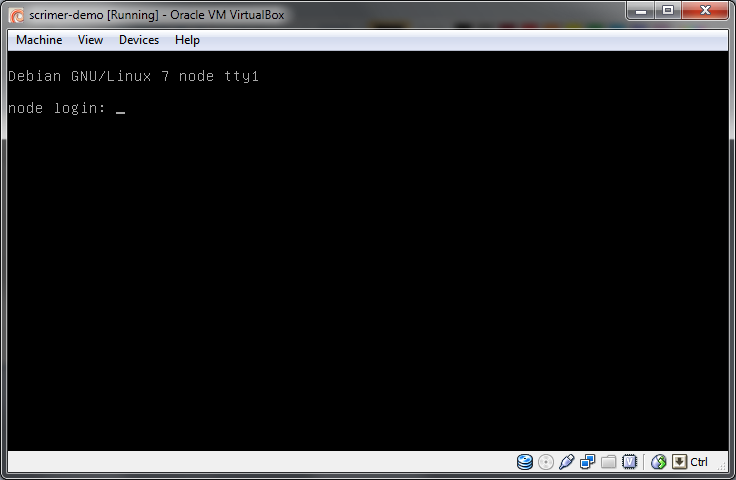
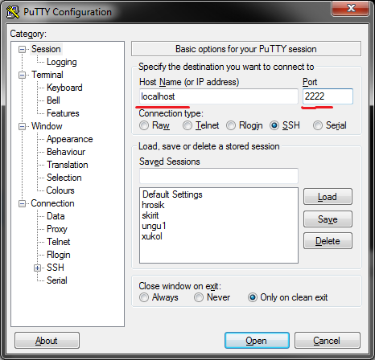
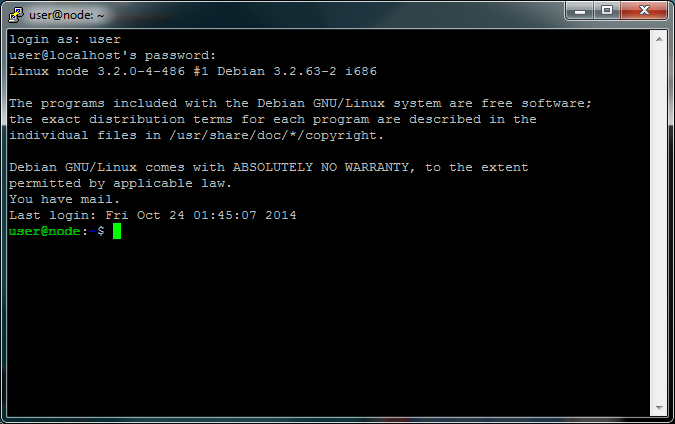
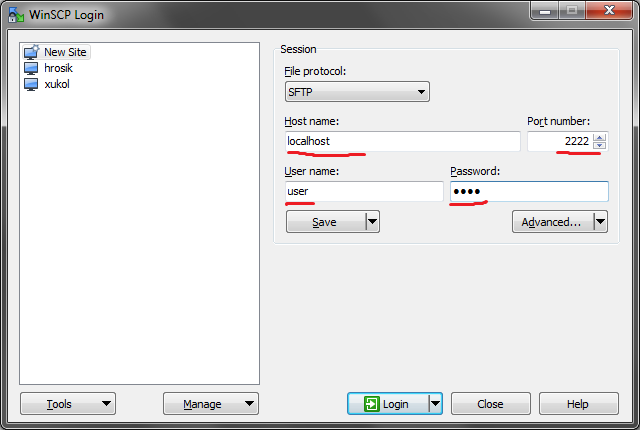

Scrimer virtual machine
=======================
The virtual machine is the easiest way to test Scrimer. You get a computer preinstalled with Scrimer,
many of its dependencies and a test data set. The test data set is a complete scrimer run with all the
intermediate files generated from a subset of reads from our nightingale data set, using zebra finch 
as a reference genome.

The machine is set up tu use 2 GB of RAM and one CPU. Those settings can be adjusted in the main VirtualBox 
interface.

Because of licensing issues, the image does not contain Newbler. Trinity is not included as well,
because of high memory requirements of the assembly.

Virtual machine installation
^^^^^^^^^^^^^^^^^^^^^^^^^^^^
Installation steps (it should take less than 10 minutes):

- Install VirtualBox (https://www.virtualbox.org/wiki/Downloads). It works on Linux and Mac too.
- Download the virtual machine image from this link: http://goo.gl/ofOtS9 You'll get a single file with ``.ova`` extension 
  on your hard drive.
- You can either double click the ``.ova`` file, or run VirtualBox, and choose ``File > Import Appliance``.
  Follow the instructions after the import is started.

After asuccessful instalation you should see something like this (only the machine list will contain jsut one machine).
Check whether you can start the virtual machine: click ``Start`` in the main VirtualBox window:

After a while you should see something like this:

You don't need to type anything into that window, just checking that it looks like the screenshot is enough.

Machine configuration details:

- Administrative user: `root`, password: `debian`
- Normal user: `user`, password: `user`
- ssh on port 2222

Windows
-------
Install PuTTY and WinSCP. PuTTY will be used to control the virtual computer. WinSCP will be used to transfer
files between your computer and the virtual computer.

- PuTTY (http://www.chiark.greenend.org.uk/~sgtatham/putty/download.html - look for putty.exe) 
- WinSCP (http://winscp.net/eng/download.php - look for Installation package). 

Mac OS X and Linux
------------------
Ssh is used to control the virtual computer. It should be installed in your computer.

Files can be transferred with ``scp``, ``rsync`` or ``lftp`` (recommended) 
from the command line. `Scp` and `rsync` could be already installed in your system, 
if you want to use `lftp`, you'll probably have to install it yourself.

Mac users that prefer grapical clients can use something like `CyberDuck`. See
http://apple.stackexchange.com/questions/25661/whats-a-good-graphical-sftp-utility-for-os-x .

Connecting to the virtual machine
^^^^^^^^^^^^^^^^^^^^^^^^^^^^^^^^^

.. note:: 
  You need to start the virtual machine first!

.. _ssh_connect:

Connect to control the machine
------------------------------
To control the machine, you need to connect to the ssh service.

In Windows this is done with PuTTY.

- start PuTTY
- fill Host Name: ``localhost``
- fill Port: ``2222``
- click Open or press <Enter>

In the black wnidow that appears, type your credentials:

- login as: ``user``
- user@localhost’s password: ``user``

In Mac OS X or Linux, this is done with ssh tool::

  ssh -p 2222 user@localhost

Connect to copy files
---------------------
In Windows, WinSCP is used to copy files to Linux machines. You use the same information
as for PuTTY to log in.

In Mac OS X or Linux, the most simple command to copy a file into 
a home directory of ``user`` on a running virtual machine is::

  scp -P 2222 myfile user@localhost:~
